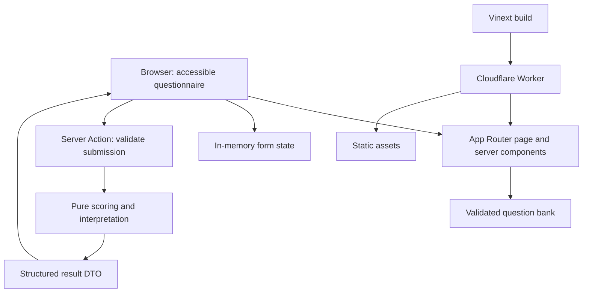

# Target architecture

Status: proposed implementation architecture. Repository baseline is summarized in [README](./README.md); delivery order is in [project-plan](./project-plan.md).

## Objectives and constraints

Build a responsive adult self-report questionnaire that can grow in screens, content and traffic without coupling presentation to scoring or Cloudflare APIs. The result is a criteria-informed summary for a clinical discussion, not a diagnosis, probability or replacement for assessment. The first release is English, anonymous and in-memory for the open browser page. Do not add accounts, local or server storage, analytics containing answers, or remote model inference in this release.

Keep the established Next.js App Router application and Vinext → Cloudflare Worker deployment on `develop`. `main` is the documented production branch. No static export. The Worker should remain stateless for the initial release; static assets are served through the existing `ASSETS` binding.

## Context and data flow



The browser receives only the question fields and labels it needs. React Hook Form holds answers in memory while the page remains open; submission sends a complete payload to a Server Action. The action validates untrusted values against the versioned bank, invokes a pure scoring function and returns a serializable result. No answer is persisted on the server. The result view explains counts and context separately and can be rendered from the structured result. Client-side React Hook Form validation is for guidance; server action validation is authoritative. Submit through a form-bound Server Action with React `useActionState` for pending, structured errors and result, or the equivalent supported action invocation after a real Worker preview proves it; do not add a separate JSON API for the same flow. The same pure scoring function can later back a route handler if an explicitly approved integration requires one.

## Suggested module layout

The layout is a target, not a demand to create empty directories.

```text
app/
  (assessment)/assessment/page.tsx       # server composition; load safe bank projection
  (assessment)/assessment/actions.ts      # "use server"; validate and call use case
  (assessment)/assessment/result/...      # result presentation, as chosen in implementation
components/
  ui/                                      # generic controls: Button, RadioGroup, Progress
  assessment/                              # QuestionCard, MatrixQuestion, Review, Result
features/assessment/
  domain/                                  # pure score, pattern, interpretation, types
  application/                             # submit use case and bank-to-UI projection
  contracts/                               # request/result Zod schemas and version
  client/                                  # form controller, step selectors, error focus
lib/
  schemas/adhd-questions.ts                # existing bank validation
  server/adhd-questions.ts                 # existing server-only bank import
data/adhd-questions.json                   # existing reviewed content and rules
```

Dependency direction: `app` composes `components` and `features`; assessment components depend on public contracts and client selectors; the application layer depends on the domain and validated bank; the domain depends on plain types and rules only. `domain` must not import React, Next.js, Wrangler, browser storage or server modules. Generic `components/ui` must not know question IDs or scoring. The server-only bank must never be imported into client components. React Hook Form owns editable form values; avoid a second reducer duplicating the answers. Keep route files thin and separate the action's transport concerns from domain rules. Avoid a generic plugin framework until a second real questionnaire demonstrates the need.

## Contracts and scoring invariants

- Pin a `schema_version` on every submitted answer set and result. Reject stale or unknown versions with a recoverable UI message; do not silently score against changed questions.
- Define an explicit answer schema for exactly q01–q19 and q20's four named rows. Ensure all values are allowed by the bank, detect missing/extra IDs and reject incomplete submissions. Keep the result DTO serializable and code based; presentation maps codes to reviewed human language.
- Calculate q01–q09 and q10–q18 counts independently (0–9). Only `often` and `very_often` count; thresholds and rule order come from the validated bank and [SCORING.md](../data/SCORING.md). No weighted percent or diagnosis.
- Return one of the four pattern codes and one of the three combination codes. Include every context response and a separate review flag for `possible_other_explanations = yes`. `no` or `unsure` on that row does not rule out another explanation.
- Maintain one source for rules. Avoid copying threshold constants into controls, reducers and result components. Lock reviewed fixtures to the current bank version; update fixtures, scoring guide and bank together when rules change.
- A scoring module must accept explicit bank/rules and answer inputs, with no network or clock dependency. Unit tests should cover thresholds 4/5, all pattern branches, context `yes/no/unsure`, missing/malformed answers and version mismatch.

## UI architecture and scalability

Adopt the existing Tailwind CSS 4 for tokens and responsive styling. Add **shadcn/ui with Radix UI primitives** for a small, locally owned set of accessible Button, Radio Group, Progress and feedback components; use native fieldset/legend semantics where they are better suited to the matrix. Add **React Hook Form** for form state and field-level validation, **@hookform/resolvers** with the existing **Zod 4** schemas for client guidance, and **Lucide React** for optional decorative icons. Keep the component source in `components/ui` and theme tokens in CSS; wrap library controls behind assessment components so library changes do not touch scoring. Install only the components in use, lock dependencies, and prove React 19 / Next 16 / Vinext / Zod 4 compatibility with typecheck, build and Worker preview before adopting the stack across the questionnaire. The server action validates again independently.

Use server components for the shell, metadata and question-bank projection, and a small client island for step navigation and in-memory form state. Render question types through explicit `single_select` and `matrix_single_select` components. Group questions into short, data-driven steps; progress and next/back behavior are derived from the bank rather than copied route state. Keep stable IDs and labels so browser refresh or restored drafts cannot shift answers to different questions.

Provide a calm, narrow reading column with a clear step heading, progress text, one primary action, visible back navigation and a final review step. Use responsive layouts and reusable design tokens for spacing, typography, colors, focus rings and states. Avoid animation as a requirement; honor reduced-motion preferences. Build controls with native form semantics, fieldsets/legends, associated labels, error descriptions, keyboard access, visible focus, sensible touch targets and live feedback that does not announce every keystroke. Aim for WCAG 2.2 AA and verify with keyboard and assistive technology testing.

Keep only active-step components mounted if the form becomes large; memoize or virtualize only after profiling. The 20-question bank is small, so avoid introducing a global state service or heavy UI framework on speculation. Keep assets lean, avoid unnecessary client libraries, and measure bundle size and real preview performance before optimization. Separate visual tokens, primitives and domain components so new screens can reuse the system without duplicating questionnaire logic.

Answers remain in memory until submission or page close/reload. Provide an explicit Clear answers control and tell users on the intro/review screen that refreshing or closing the page loses progress and that submission sends answers to the Worker for scoring. Do not encode answers in URLs or log payloads.

## Trust boundaries and privacy

Treat the browser as untrusted. Validate payload shape, bank version and size in the action. Return field-level validation errors without echoing sensitive values. No secrets in client bundles. Redact or avoid answer bodies and result details in application logs, telemetry, error reports and preview diagnostics. Use HTTPS on the deployed origin; apply a restrictive content security policy after testing framework assets. Add rate/abuse controls if traffic or public API exposure warrants them. Define retention and deletion before adopting D1, KV, R2, durable objects or third-party analytics.

The questionnaire serves adults 18+ and should communicate its limits at entry and result. Have the wording and thresholds reviewed by a qualified clinical reviewer before public use. Avoid language that promises diagnosis or indicates absence of ADHD from a low count.

## Cloudflare integration and release topology

The existing `wrangler.jsonc` declares `vinext/server/fetch-handler`, `dist/client`, `ASSETS`, `nodejs_compat` and previews. `vite.config.ts` combines Vinext with the Cloudflare Vite plugin. The build script runs `vinext build`; deployment and preview commands use `dist/server/wrangler.json`. Preserve this contract and follow [the preview guide](./best-practices/enable-cloudfare-previews.md). The owner confirms that the existing Cloudflare deployment is working. Preserve its dashboard branch/build settings, route and access policy; record the effective configuration and preview URL as release evidence when implementation begins.

Feature work flows through PRs into `develop`, verifies a Worker preview, then promotes via the existing `main` production path after review. Keep preview and production secrets/bindings separate. No data bindings are needed for the initial anonymous flow. CI should run install, lint, typecheck, unit/component tests and Vinext build; a deployed preview must test the real Server Action. On a failure, revert the production commit or redeploy the last known good build under the existing Cloudflare process. A reload intentionally clears the in-memory answers; make this behavior clear to users.

## Operability and growth triggers

Capture privacy-safe request counts, action error categories and latency, plus client web vitals where consent and policy allow. Start with explicit targets to validate in a baseline: no uncaught errors in the main journey, p95 action latency under 1 second excluding network, and no material regression in LCP/INP/CLS on mobile previews. Measure before setting an SLA. Verify Worker limits, bundle size and cold behavior in the actual account.

Only add persistence for a stated need (for example recovery after refresh or cross-device progress) after consent, access control, retention, migrations, encryption and threat modeling are specified. Only split the Worker/API when measured traffic, team ownership or integration needs justify it. Keep DTO and domain boundaries in place so either change can be made without rewriting the UI.
